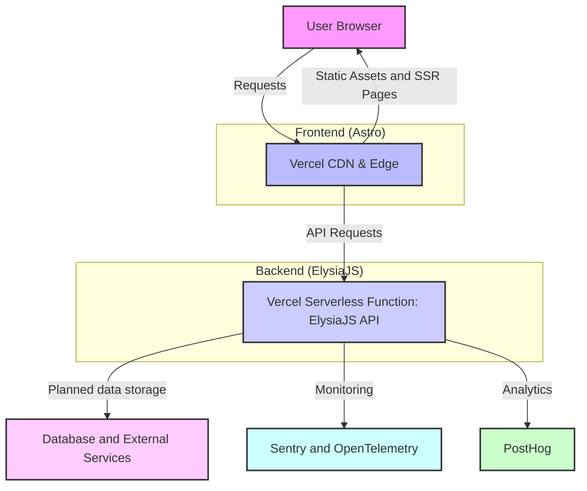

<!--
  Generated by AI-Powered README Generator
  Repository: https://github.com/ElysiumOSS/elysium
  Generated: 2025-11-10T09:00:27.357Z
  Format: md
  Style: comprehensive
-->

# Elysium: The High-Performance Web Platform

A Modern Web Platform powered by Astro & ElysiaJS for high-performance content delivery and robust API services.

[](https://github.com/ElysiumOSS/elysium/actions/workflows/ci.yml)
[](https://github.com/ElysiumOSS/elysium/blob/main/LICENSE)
[](https://github.com/ElysiumOSS/elysium/releases)
[](https://www.typescriptlang.org/)
[](https://astro.build/)
[](https://elysiajs.com/)

## 🚀 Table of Contents

*   [Overview](#overview)
*   [Feature Highlights](#feature-highlights)
*   [Architecture & Design](#architecture--design)
    *   [High-Level Architecture](#high-level-architecture)
    *   [Core Modules](#core-modules)
    *   [Technology Stack](#technology-stack)
*   [Getting Started](#getting-started)
    *   [Prerequisites](#prerequisites)
    *   [Installation](#installation)
    *   [Configuration](#configuration)
    *   [Running the Application](#running-the-application)
*   [Usage & Workflows](#usage--workflows)
    *   [Website Navigation](#website-navigation)
    *   [API Endpoints](#api-endpoints)
    *   [Common Use Cases](#common-use-cases)
*   [Limitations, Known Issues & Future Roadmap](#limitations-known-issues--future-roadmap)
    *   [Current Limitations](#current-limitations)
    *   [Known Issues](#known-issues)
    *   [Future Roadmap](#future-roadmap)
*   [Contributing & Development Guidelines](#contributing--development-guidelines)
    *   [How to Contribute](#how-to-contribute)
    *   [Branching & Pull Request Guidelines](#branching--pull-request-guidelines)
    *   [Code Style & Quality](#code-style--quality)
    *   [Development Setup](#development-setup)
*   [License, Credits & Contact](#license-credits--contact)
    *   [License](#license)
    *   [Acknowledgments & Third-Party Dependencies](#acknowledgments--third-party-dependencies)
    *   [Contact](#contact)
*   [Appendix](#appendix)
    *   [Changelog](#changelog)
    *   [Frequently Asked Questions (FAQ)](#frequently-asked-questions-faq)
    *   [Troubleshooting](#troubleshooting)
    *   [API Reference](#api-reference)

## Overview

Elysium is a cutting-edge web platform designed for unparalleled performance, scalability, and developer experience. It seamlessly integrates a fast, static-site-generation (SSG) capable frontend built with [Astro](https://astro.build/) with a highly efficient, lightweight API backend powered by [ElysiaJS](https://elysiajs.com/). This architecture provides a robust foundation for building modern web applications, content-rich websites, and high-performance API services.

**Purpose & Goals:**

Our primary goals for Elysium are:
*   ⚡ **Exceptional Performance:** Leverage Astro's island architecture and ElysiaJS's Bun-first design for lightning-fast page loads and API response times.
*   ⚙️ **Developer Efficiency:** Provide a streamlined development workflow with TypeScript, intuitive API routing, and component-based frontend development.
*   🔒 **Robust Security & Observability:** Integrate Sentry for error tracking, OpenTelemetry for distributed tracing, and various ElysiaJS plugins for enhanced security (e.g., Helmet, CORS, Rate Limiting).
*   📈 **Scalability:** Designed to be easily deployed on serverless platforms like Vercel, ensuring elastic scalability to handle varying loads.
*   ✨ **Rich User Experience:** Offer smooth transitions, animations (GSAP, Lenis), and SEO-friendly practices for an engaging user interface.

**Problem Solved:**

In today's web landscape, users expect instant load times and seamless interactions. Traditional monolithic architectures or separate frontend/backend setups often introduce complexity, performance bottlenecks, and deployment challenges. Elysium addresses this by offering a unified, performant, and easily deployable solution that handles both content delivery and complex API interactions efficiently. It mitigates the common pitfalls of slow websites, difficult-to-maintain APIs, and fragmented development experiences.

**Target Audience:**

*   **Web Developers:** Looking for a modern, performant, and type-safe stack for full-stack web development.
*   **Content Creators & Marketers:** Needing a fast, SEO-friendly platform to deliver engaging content.
*   **Organizations & Startups:** Requiring a scalable, reliable, and observable infrastructure for their web applications and services.
*   **API Developers:** Seeking a high-performance, developer-friendly framework for building RESTful or RPC APIs.

<div align="right">
  <a href="#elysium-the-high-performance-web-platform">⬆️ Back to Top</a>
</div>

## Feature Highlights

Elysium is packed with features designed to provide a comprehensive and robust web platform.

### 🚀 Performance & User Experience
*   ✅ **Blazing Fast Frontend:** Powered by Astro for near-instant page loads and optimal Core Web Vitals.
*   ✨ **Smooth Animations:** Integrated with GSAP and Lenis for fluid scrolling and captivating UI transitions.
*   🔍 **SEO Optimized:** Built-in sitemap generation and SEO components (`astro-seo`) for better search engine visibility.
*   🖼️ **Optimized Media Handling:** Efficiently serves images and media, leveraging `sharp` for processing.
*   🔗 **Open Graph Scraping:** Uses `open-graph-scraper` for rich social media previews and sharing.

### 💻 Robust API Backend
*   ⚡ **High-Performance API:** Developed with ElysiaJS, a fast, Bun-first web framework, ensuring minimal overhead and rapid response times.
*   🔒 **Secure Authentication:** Built-in bearer token authentication (`@elysiajs/bearer`) for protected routes.
*   🛡️ **Enhanced Security:** Implements `elysiajs-helmet` for a suite of security best practices and `elysia-rate-limit` to prevent abuse.
*   🧩 **Modular API Routes:** Clearly organized API endpoints for `auth`, `health`, `info`, `media`, `protected`, `utility`, and `version` services.
*   📝 **Swagger Documentation:** Automatically generated API documentation via `@elysiajs/swagger` for easy API exploration and consumption.
*   🌐 **CORS Support:** Configurable Cross-Origin Resource Sharing (`@elysiajs/cors`) for flexible frontend integration.
*   📈 **Type-Safe Development:** Leverages TypeScript and `@effect/schema` for robust, type-checked API contracts.

### 📊 Observability & Monitoring
*   🐛 **Real-time Error Tracking:** Seamless integration with Sentry (`@sentry/astro`, `sentry.client.config.js`, `sentry.server.config.js`) for comprehensive error monitoring and performance insights.
*   🔭 **Distributed Tracing:** Implements OpenTelemetry (`@elysiajs/opentelemetry`, `@opentelemetry/sdk-trace-node`) for end-to-end transaction visibility across services.
*   📊 **Analytics Integration:** Includes PostHog for product analytics and user behavior tracking.
*   ⏱️ **Server Timing:** Provides server-side performance metrics via `@elysiajs/server-timing`.
*   📜 **Structured Logging:** Utilizes `logixlysia` for intelligent, customizable logging.

### 🛠️ Development & Deployment
*   ☁️ **Vercel Optimized:** Configured for serverless deployment on Vercel (`@astrojs/vercel`) for easy scaling and global distribution.
*   📦 **Monorepo-Friendly Structure:** Designed with a clear separation of concerns, supporting future expansion.
*   🚀 **Modern Toolchain:** Uses Vite, TailwindCSS (with DaisyUI), and Astro for a modern, efficient development experience.
*   🔄 **Service Worker:** Includes `service-worker.js` for offline capabilities and improved asset caching.

<div align="right">
  <a href="#elysium-the-high-performance-web-platform">⬆️ Back to Top</a>
</div>

## Architecture & Design

Elysium employs a modern, hybrid architecture combining a high-performance frontend with a lightweight, robust API backend. This design ensures optimal performance, scalability, and maintainability.

### High-Level Architecture

The platform operates on a Serverless-First principle, leveraging Vercel for deployment, which handles both the Astro SSR/SSG content and the ElysiaJS API functions.



**Explanation of Flow:**

1.  **User Browser:** Initiates requests for web pages or API data.
2.  **Vercel CDN/Edge:** Serves static assets (HTML, CSS, JS, images) directly from its global CDN for maximum speed. For dynamic pages or API calls, it routes requests to appropriate serverless functions.
3.  **Vercel Serverless Function (ElysiaJS API):** For API requests, Vercel invokes a serverless function running the ElysiaJS application. This function handles business logic, interacts with data stores, and returns responses.
4.  **Database / External Services:** The ElysiaJS API interacts with various backend services or databases (e.g., PostgreSQL, MongoDB, third-party APIs) to retrieve or persist data. *(Currently, direct database interaction is planned but not fully implemented in the provided code structure, focusing more on the API infrastructure).*
5.  **Sentry / OpenTelemetry:** Both frontend and backend send error reports (Sentry) and distributed traces (OpenTelemetry) to monitoring services for robust observability.
6.  **PostHog:** Frontend captures user analytics events for product insights.

### Core Modules

The application's codebase is structured into logical modules to enhance maintainability and collaboration:

*   **`src/api/routes`**: This directory houses all the ElysiaJS API endpoints. Each subdirectory (e.g., `auth`, `health`, `info`, `media`, `protected`, `utility`, `version`) represents a distinct API domain, promoting modularity and clear separation of concerns.
*   **`src/components`**: Contains reusable Astro components (e.g., `hero.astro`, `navbar.astro`, `footer.astro`) that form the building blocks of the frontend UI.
*   **`src/core`**: Holds core application logic, including:
    *   `config/`: Application constants and configurations.
    *   `errors/`: Centralized error handling and custom error types.
    *   `helpers/`: General utility functions.
    *   `middleware-handlers/`: Custom middleware for both Astro and ElysiaJS (where applicable).
    *   `types/`: Shared TypeScript type definitions.
*   **`src/pages`**: Astro pages that define the routes and content for the public-facing website (e.g., `index.astro`, `about.astro`, `support.astro`).
*   **`public/`**: Static assets like favicons, `robots.txt`, `manifest.json`, and service workers.
*   **`lib/`**: External library integrations or helper functions like `open-graph-scraper`.

### Technology Stack

Elysium is built upon a modern and high-performance technology stack:

*   **Frontend Framework**: [Astro](https://astro.build/) (v5.x) for fast content-focused websites, SSR, and SSG.
*   **Backend Framework**: [ElysiaJS](https://elysiajs.com/) (v1.4.x) for high-performance, type-safe APIs, often run with Bun.
*   **Programming Language**: [TypeScript](https://www.typescriptlang.org/) for type safety across the entire application.
*   **Styling**: [TailwindCSS](https://tailwindcss.com/) (v4.x) with [DaisyUI](https://daisyui.com/) for utility-first CSS and component themes.
*   **Deployment**: [Vercel](https://vercel.com/) via `@astrojs/vercel` adapter for serverless deployments.
*   **Error Tracking**: [Sentry](https://sentry.io/) via `@sentry/astro` for real-time error monitoring.
*   **Distributed Tracing**: [OpenTelemetry](https://opentelemetry.io/) for end-to-end observability of requests.
*   **Analytics**: [PostHog](https://posthog.com/) for product analytics and user behavior.
*   **Animations**: [GSAP](https://gsap.com/) (GreenSock Animation Platform) and [Lenis](https://lenis.studio/) for smooth scrolling and animations.
*   **API Documentation**: [Swagger (OpenAPI)](https://swagger.io/) via `@elysiajs/swagger`.
*   **Build Tool**: [Vite](https://vitejs.dev/).
*   **Utilities**: `sharp` for image processing, `open-graph-scraper` for social media meta tags.

<div align="right">
  <a href="#elysium-the-high-performance-web-platform">⬆️ Back to Top</a>
</div>

## Getting Started

Follow these steps to get Elysium up and running on your local machine for development and testing.

### Prerequisites

Before you begin, ensure you have the following installed:

*   **Node.js**: `v18.x` or higher.
    *   [Download Node.js](https://nodejs.org/en/download/)
*   **npm** (Node Package Manager): Usually comes with Node.js, or **Yarn**/ **pnpm** (preferred for speed).
    *   `npm install -g yarn` or `npm install -g pnpm`
*   **Git**: For cloning the repository.
    *   [Download Git](https://git-scm.com/downloads)
*   **(Optional but Recommended) Bun**: For significantly faster dependency installation and script execution, especially with ElysiaJS.
    *   [Install Bun](https://bun.sh/docs/installation)

### Installation

1.  **Clone the Repository:**
    ```bash
    git clone https://github.com/ElysiumOSS/elysium.git
    cd elysium
    ```

2.  **Install Dependencies:**
    Choose your preferred package manager:
    *   **Using npm:**
        ```bash
        npm install
        ```
    *   **Using Yarn:**
        ```bash
        yarn install
        ```
    *   **Using pnpm:**
        ```bash
        pnpm install
        ```
    *   **Using Bun (fastest):**
        ```bash
        bun install
        ```

### Configuration

Elysium uses environment variables for sensitive information and configuration settings.

1.  **Create a `.env` file:**
    In the root of your project, create a file named `.env` (or `.env.development` for local development).

2.  **Add Environment Variables:**
    Populate your `.env` file with the following minimum required variables. You can find their usage in `sentry.client.config.js` and `sentry.server.config.js`.

    ```ini
    # General App Configuration
    PUBLIC_APP_VERSION="0.0.1" # Matches package.json version
    MODE="development"         # or "production"

    # Sentry DSN (for error tracking)
    # Get your DSN from Sentry.io project settings
    PUBLIC_SENTRY_DSN="YOUR_SENTRY_CLIENT_DSN_HERE"
    SENTRY_AUTH_TOKEN="YOUR_SENTRY_SERVER_AUTH_TOKEN_HERE" # Required for server-side Sentry integration with Vercel

    # PostHog (for analytics)
    PUBLIC_POSTHOG_API_KEY="YOUR_POSTHOG_API_KEY_HERE"
    PUBLIC_POSTHOG_API_HOST="https://app.posthog.com" # Or your self-hosted instance
    ```

    💡 **Tip:** For production deployments (e.g., Vercel), configure these environment variables directly in your deployment platform's settings.

### Running the Application

#### Development Mode

To run the application in development mode with hot-reloading and detailed logging:

```bash
# Using npm
npm run dev

# Using Yarn
yarn dev

# Using pnpm
pnpm dev

# Using Bun
bun dev
```
The application will be accessible at `http://localhost:4321`.

#### Building for Production

To build the optimized production version of the application:

```bash
# Using npm
npm run build

# Using Yarn
yarn build

# Using pnpm
pnpm build

# Using Bun
bun build
```
This command compiles the Astro frontend and the ElysiaJS backend into the `./dist/` directory, ready for deployment.

#### Previewing Production Build Locally

After building, you can preview the production build locally to ensure everything works as expected before deploying:

```bash
# Using npm
npm run preview

# Using Yarn
yarn preview

# Using pnpm
pnpm preview

# Using Bun
bun preview
```
The preview server will typically run on `http://localhost:4321` (or another available port).

<div align="right">
  <a href="#elysium-the-high-performance-web-platform">⬆️ Back to Top</a>
</div>

## Usage & Workflows

Elysium provides both a public-facing website and a robust API backend. This section details how to interact with both.

### Website Navigation

The Elysium website is designed to be intuitive and fast.

*   **Home Page (`/`)**: Discover the main features and purpose of Elysium.
*   **About Page (`/about`)**: Learn more about the project, its goals, and the team.
*   **Support Page (`/support`)**: Find resources for help and support.
*   **Interactive Elements**: Experience smooth scrolling and dynamic content powered by GSAP and Lenis.

### API Endpoints

The ElysiaJS API serves as the backbone for dynamic content and backend services. API documentation is automatically generated and available via Swagger UI once the application is running.

**Accessing Swagger UI:**
When running in development mode, access the API documentation at: `http://localhost:4321/swagger`

Here are some example API endpoints:

<details>
<summary>⚡ **Health Check** - `GET /api/health`</summary>

Checks the operational status of the API.

**Request:**
```bash
curl -X GET http://localhost:4321/api/health
```

**Response (200 OK):**
```json
{
  "status": "ok",
  "timestamp": "2024-07-30T12:00:00.000Z"
}
```
</details>

<details>
<summary>📝 **Get Version Info** - `GET /api/version`</summary>

Retrieves the current version of the API.

**Request:**
```bash
curl -X GET http://localhost:4321/api/version
```

**Response (200 OK):**
```json
{
  "version": "0.0.1",
  "name": "elysium-api"
}
```
</details>

<details>
<summary>🔑 **User Authentication** - `POST /api/auth`</summary>

Authenticates a user and returns a bearer token. *(Note: Actual implementation details may vary, this is a conceptual example for the `src/api/routes/auth` endpoint).*

**Request (example with `username` and `password`):**
```bash
curl -X POST -H "Content-Type: application/json" \
     -d '{"username": "user", "password": "password123"}' \
     http://localhost:4321/api/auth
```

**Response (200 OK - conceptual):**
```json
{
  "success": true,
  "token": "eyJhbGciOiJIUzI1NiIsInR5cCI6IkpXVCJ9...",
  "expiresIn": "1h"
}
```
</details>

<details>
<summary>🛡️ **Access Protected Data** - `GET /api/protected`</summary>

Accesses a resource that requires a valid bearer token.

**Request (replace `YOUR_AUTH_TOKEN`):**
```bash
curl -X GET -H "Authorization: Bearer YOUR_AUTH_TOKEN" \
     http://localhost:4321/api/protected
```

**Response (200 OK - conceptual):**
```json
{
  "message": "Welcome to the protected zone!",
  "user": {
    "id": "abc-123",
    "role": "admin"
  }
}
```

**Response (401 Unauthorized - without token):**
```json
{
  "code": "UNAUTHORIZED",
  "message": "Unauthorized"
}
```
</details>

### Common Use Cases

*   **Building a Marketing Website:** Leverage Astro's fast rendering for SEO-friendly content pages, enhanced by Elysium's API for dynamic data, forms, or user interactions.
*   **Developing a SaaS Product Frontend:** Use Elysium's robust API for user management, data storage, and business logic, while the Astro frontend provides a responsive and performant user interface.
*   **Creating a Content Hub:** Combine Astro's content management capabilities with Elysium's API to manage and deliver rich media content efficiently, including Open Graph meta-tags for social sharing.
*   **Internal Tools:** Deploy internal dashboards or management interfaces where Elysium's API handles backend operations and the Astro frontend provides an intuitive UI for administrators.

<div align="right">
  <a href="#elysium-the-high-performance-web-platform">⬆️ Back to Top</a>
</div>

## Limitations, Known Issues & Future Roadmap

Elysium is under active development. This section outlines current considerations and plans for future enhancements.

### Current Limitations

*   **Database Integration:** While the architecture allows for various data storage solutions, direct database integration (e.g., ORM setup, connection pooling) is not fully represented in the provided core modules and may require additional setup based on your chosen database.
*   **Comprehensive Testing:** Initial versions may have limited unit/integration test coverage, which will be expanded over time.
*   **Authentication Provider Agnostic:** Currently, authentication is based on bearer tokens. Integration with specific OAuth providers or more complex identity management systems would require further development.
*   **Admin Interface:** There is no built-in administrative interface for managing content or users; such features would need to be built on top of the existing API.

### Known Issues

*   **Sentry DSN Warning:** If `PUBLIC_SENTRY_DSN` is not configured, Sentry will log a warning to the console during startup, as indicated in `sentry.client.config.js` and `sentry.server.config.js`. This is expected behavior and serves as a reminder to configure Sentry.
*   **Initial Build Times:** Depending on your environment and dependencies, the initial `npm run build` might take a moment due to comprehensive optimizations.

### Future Roadmap

We have exciting plans for the evolution of Elysium:

*   **Full Database Integration:** Implement support for popular databases (e.g., PostgreSQL, MongoDB) with ORM/ODM solutions, including migration tools.
*   **Enhanced API Features:** Expand API routes with advanced functionalities such as file uploads, real-time communication (WebSockets), and more complex query capabilities.
*   **Authentication & Authorization Module:** Develop a more abstract and configurable authentication module, supporting various strategies (e.g., OAuth, SSO).
*   **CLI Tooling:** Introduce custom CLI commands for scaffolding new API routes, components, or deploying the application.
*   **Internationalization (i18n):** Add full support for multiple languages on the frontend.
*   **Theming & Customization:** Provide more extensive theming options and component customization utilities.
*   **Automated Testing:** Increase unit, integration, and end-to-end test coverage for all core modules and API endpoints.
*   **Performance Benchmarking:** Regular performance testing and optimization cycles for both frontend and backend.

We welcome feature requests and contributions to help shape the future of Elysium!

<div align="right">
  <a href="#elysium-the-high-performance-web-platform">⬆️ Back to Top</a>
</div>

## Contributing & Development Guidelines

We welcome contributions to Elysium! Whether it's reporting a bug, suggesting an enhancement, or submitting code, your help is invaluable.

### How to Contribute

1.  **Fork the Repository:** Start by forking the `ElysiumOSS/elysium` repository to your GitHub account.
2.  **Clone Your Fork:**
    ```bash
    git clone https://github.com/YOUR_USERNAME/elysium.git
    cd elysium
    ```
3.  **Create a New Branch:**
    For features, use `feat/<feature-name>`. For bug fixes, use `fix/<bug-description>`.
    ```bash
    git checkout -b feat/my-new-feature
    ```
4.  **Make Your Changes:** Implement your feature or fix, ensuring to follow the code style guidelines.
5.  **Test Your Changes:** Run tests and ensure all existing functionalities are preserved and your new changes work as expected.
6.  **Commit Your Changes:** Use clear, concise commit messages. We encourage [Conventional Commits](https://www.conventionalcommits.org/en/v1.0.0/).
    ```bash
    git commit -m "feat(module): Add new authentication endpoint"
    ```
7.  **Push to Your Fork:**
    ```bash
    git push origin feat/my-new-feature
    ```
8.  **Create a Pull Request (PR):**
    Open a PR from your forked repository to the `main` branch of `ElysiumOSS/elysium`. Provide a clear description of your changes and reference any related issues.

### Branching & Pull Request Guidelines

*   **`main` branch:** This branch contains the latest stable and deployed version. All PRs should target this branch.
*   **Feature Branches:** All development work should be done in dedicated feature or bugfix branches.
*   **Squash and Merge:** We typically prefer to squash and merge PRs to maintain a clean Git history.
*   **Code Review:** All pull requests require at least one approval from a maintainer before merging.

### Code Style & Quality

*   **TypeScript First:** All new code should be written in TypeScript, leveraging its type safety features.
*   **Linting & Formatting:** Adhere to the existing ESLint and Prettier configurations. Your IDE should ideally integrate with these tools.
    *   Ensure your code is formatted before committing: `npm run format` (if defined, otherwise `npx prettier --write .`)
    *   Check for linting errors: `npm run lint` (if defined, otherwise `npx eslint .`)
*   **Testing:** Write unit and integration tests for new features and bug fixes to ensure reliability and prevent regressions.

### Development Setup

*   **IDE:** We recommend using [VS Code](https://code.visualstudio.com/) with the following extensions:
    *   ESLint
    *   Prettier
    *   TypeScript Vue Plugin (Volar) / Astro Language Support
    *   Tailwind CSS IntelliSense
    *   Mermaid syntax highlighting extensions
*   **Bun Integration:** For the fastest development experience, consider installing [Bun](https://bun.sh/) and using `bun install` and `bun dev`.

<div align="right">
  <a href="#elysium-the-high-performance-web-platform">⬆️ Back to Top</a>
</div>

## License, Credits & Contact

### License

Elysium is released under the [Apache License, Version 2.0](https://www.apache.org/licenses/LICENSE-2.0).
You can find the full license text in the [LICENSE](https://github.com/ElysiumOSS/elysium/blob/main/LICENSE) file in the root of this repository.

```
Copyright 2025 Elysium OSS

Licensed under the Apache License, Version 2.0 (the "License");
you may not use this file except in compliance with the License.
You may obtain a copy of the License at

    http://www.apache.org/licenses/LICENSE-2.0

Unless required by applicable law or agreed to in writing, software
distributed under the License is distributed on an "AS IS" BASIS,
WITHOUT WARRANTIES OR CONDITIONS OF ANY KIND, either express or implied.
See the License for the specific language governing permissions and
limitations under the License.
```

### Acknowledgments & Third-Party Dependencies

Elysium is built upon the incredible work of many open-source projects. We extend our gratitude to:

*   **Astro**: The web framework for building fast, content-focused websites.
*   **ElysiaJS**: The fast, Bun-first web framework for our API.
*   **TypeScript**: For providing type safety and improving developer experience.
*   **TailwindCSS & DaisyUI**: For efficient and beautiful styling.
*   **Vercel**: For seamless serverless deployment.
*   **Sentry & OpenTelemetry**: For robust error tracking and observability.
*   **PostHog**: For comprehensive product analytics.
*   **GSAP & Lenis**: For enhancing user experience with smooth animations.
*   And all other direct and transitive dependencies listed in `package.json`.

### Contact

For questions, suggestions, or collaboration inquiries, please reach out to the Elysium OSS team via:

*   **GitHub Issues**: [ElysiumOSS/elysium/issues](https://github.com/ElysiumOSS/elysium/issues)
*   **Project Website**: [https://elysium.tools](https://elysium.tools)

<div align="right">
  <a href="#elysium-the-high-performance-web-platform">⬆️ Back to Top</a>
</div>

## Appendix

### Changelog

#### `v0.0.1` - Initial Release (YYYY-MM-DD)

*   Initial project setup with Astro, ElysiaJS, and TypeScript.
*   Core API routes for `auth`, `health`, `info`, `media`, `protected`, `utility`, `version`.
*   Integrated Sentry for error tracking (client and server).
*   Integrated OpenTelemetry for distributed tracing.
*   Frontend boilerplate with Astro pages and components.
*   TailwindCSS and DaisyUI for styling.
*   Vercel deployment configuration.
*   PostHog analytics integration.
*   GSAP and Lenis for animations.
*   Swagger API documentation enabled.

### Frequently Asked Questions (FAQ)

<details>
<summary>Q: Why did you choose Astro for the frontend?</summary>
A: Astro was chosen for its exceptional performance characteristics, particularly its ability to deliver nearly pure HTML and JavaScript only where necessary ("Astro Islands"). This results in very fast loading times, excellent SEO, and a great developer experience for content-heavy sites and web applications.
</details>

<details>
<summary>Q: Why ElysiaJS for the backend API?</summary>
A: ElysiaJS stands out for its high performance, type safety (thanks to TypeScript and Effect Schema), and Bun-first approach. It offers a minimalistic yet powerful framework that allows for building robust APIs with minimal overhead, making it ideal for scalable serverless functions.
</details>

<details>
<summary>Q: Can I use Node.js instead of Bun for the ElysiaJS API?</summary>
A: Yes, ElysiaJS is compatible with Node.js. While Bun is recommended for its performance benefits and integrated tooling, you can run the ElysiaJS backend with Node.js. However, the `package.json` scripts currently use `astro dev` which internally might use Node, but explicit Bun usage for ElysiaJS parts often yields better results.
</details>

<details>
<summary>Q: How do I add a new API endpoint?</summary>
A: Navigate to `src/api/routes`. Create a new directory for your endpoint (e.g., `src/api/routes/my-feature/`) and add an `index.ts` file. Define your ElysiaJS routes within this file, ensuring proper export for integration.
</details>

<details>
<summary>Q: How do I add a new frontend page?</summary>
A: Create a new `.astro` file inside `src/pages/` (e.g., `src/pages/my-new-page.astro`). Astro will automatically create a route for it (e.g., `/my-new-page`). For nested routes, create subdirectories.
</details>

### Troubleshooting

*   **`Sentry DSN is missing` warning:** This means the `PUBLIC_SENTRY_DSN` environment variable is not set. Please refer to the [Configuration](#configuration) section to set it up. Sentry will not track errors without a DSN.
*   **`Error: Cannot find module 'sharp'` during build:** This usually indicates a problem with `sharp`'s native dependencies. Ensure your environment has the necessary build tools, or try reinstalling `sharp`: `npm rebuild sharp`.
*   **API routes not working locally:**
    *   Ensure the development server is running (`npm run dev`).
    *   Check your `PUBLIC_SENTRY_DSN` and other `.env` variables for syntax errors.
    *   Verify the API route paths match those defined in `src/api/routes`.
    *   Consult the browser's developer console and server logs for error messages.
*   **Animations not working:**
    *   Check the browser's console for JavaScript errors.
    *   Ensure GSAP and Lenis scripts are correctly loaded and initialized in your Astro components (e.g., `smooth-scroll.astro`).

### API Reference

For detailed, up-to-date documentation of all available API endpoints, models, and request/response schemas, please refer to the automatically generated Swagger UI:

👉 [**OpenAPI (Swagger) Documentation**](http://localhost:4321/swagger) (Available when the application is running in development mode)

<div align="right">
  <a href="#elysium-the-high-performance-web-platform">⬆️ Back to Top</a>
</div>
